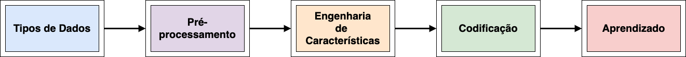
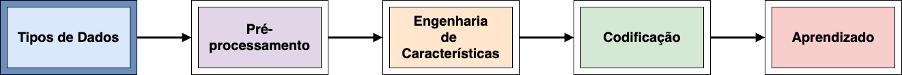
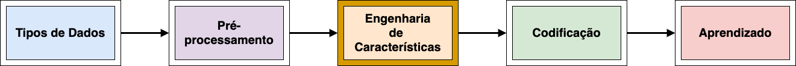
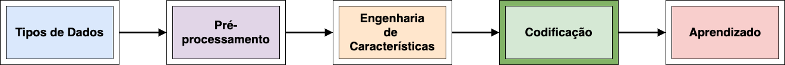
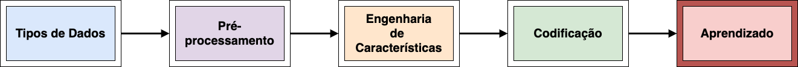

author: Lucas Zanco Ladeira
summary: Introdução à Aprendizado de Máquina
id: aprendizado-maquina
categories: platiagro
environments: Web
status: Published
feedback link: https://github.com/platiagro/tutorials

# Introdução à Aprendizado de Máquina

## Visão Geral

Esse tutorial tem o objetivo de apresentar uma introdução ao aprendizado de máquina, considerando a taxonomia simplificada e algumas características dos dados utilizados na PlatIAgro. Além disso, são utilizados como exemplo os componentes disponíveis na plataforma. O público alvo são usuários que não possuem conhecimento sobre as diferentes técnicas aplicadas no contexto de aprendizado de máquina, ou que desejam obter maior conhecimento nos componentes da PlatIAgro. Dessa maneira, o tutorial está organizado nos seguintes itens.

* **Tipos de Dados**: apresenta os diferentes tipos de dados que podem ser utilizados na plataforma e por modelos de aprendizado de máquina.

* **Pré-processamento**: apresenta o que é o pré-processamento e as técnicas mais utilizadas.

* **Engenharia de Características**: apresenta algumas estratégias para criar novas características dos dados.

* **Codificação**: apresenta algumas estratégias para codificar valores não numéricos.

* **Aprendizado**: apresenta a taxonomia de alguns dos modelos disponíveis na PlatIAgro.

## Tipos de Dados

Dados são utilizados como matéria-prima por modelos de aprendizado de máquina, sendo assim, um modelo tenta descrever o comportamentos dos dados para que seja utilizado em uma determinada tarefa. Basicamente existem dois tipos de dados: estruturados e não estruturados.

### Dados Estruturados

Os dados estruturados apresentam uma estrutura bem definida, como por exemplo: dados tabulares, bancos de dados relacionais, <i>JavaScript Object Notation</i> (JSON), entre outros. Esse tipo de dado permite a visualização das características de maneira simplificada, como a descrição de cada coluna de uma tabela, considerando dados tabulares. Além disso, outra vantagem é a facilidade em acessar valores específicos por algoritmos de busca. No contexto de aprendizado de máquina, cada dado presente em um conjunto de dados é classificado em uma das três categorias, sendo: categóricos (<i>Categorical</i>), numéricos (<i>Numerical</i>) e de data (<i>DateTime</i>). Dados categóricos representam uma característica qualitativa ou quantitativa, além disso, compreende um número fixo de valores. Por exemplo, os diferentes tipos de tratores em uma fazenda. Dados numéricos se referem a um tipo de dado que é expressado com números e representam uma característica quantitativa. Por exemplo, a quantidade de tratores em uma fazenda. Por fim, os dados de data representam um determinado instante de tempo. Por exemplo, 22/03/1992 07:00.

### Dados Não Estruturados

Dados não estruturados são dados sem uma estrutura bem definida. Alguns exemplos podem ser mencionados, tais como: textos, imagens, sons e vídeos. Esse tipo de dado apresenta características que requerem processamento para que sejam entendidas. Por exemplo, em dados de redes sociais é possível analisar a frequência das palavras para identificar qual o assunto mais mencionado. Já no caso de imagens, é necessário considerar a relação entre as cores para identificar objetos, como também, a proximidade entre esses objetos. Em um vídeo a variável temporal é de grande importância, sendo necessário analisar as mudanças que ocorrem em cada imagem ao longo do tempo. Nesse sentido, comumente são aplicadas transformações de forma a tornar mais claras as características dos dados.

## Pré-processamento

O pré-processamento se refere a técnicas aplicadas nos dados para melhorar a qualidade dos mesmos. Dados tabulares podem ter diferentes características que atrapalham o uso de modelos de aprendizado de máquina, como por exemplo, valores faltantes. As técnicas que serão abordadas estão disponíveis como componentes na PlatIAgro, e compreendem: [Filter](https://github.com/platiagro/projects/tree/master/samples/filter-selection), [Imputer](https://github.com/platiagro/projects/tree/master/samples/imputer), [Normalizer](https://github.com/platiagro/projects/tree/master/samples/normalizer), [Robust Scaler](https://github.com/platiagro/projects/tree/master/samples/robust-scaler), [Variance Threshold](https://github.com/platiagro/projects/tree/master/samples/variance-threshold), [Recursive Feature Elimination](https://github.com/platiagro/projects/tree/master/samples/rfe-selector), [Pré seleção](https://github.com/platiagro/projects/tree/master/samples/pre-selection). Esses componentes são aplicados apenas para dados tabulares.

### Filter

Algumas das colunas dos dados podem não ser importantes para descrever o seu comportamento. Por exemplo, em uma tarefa que tem o objetivo de predizer quanto será a produção de milho, o nome do coordenador dos funcionários pode não ser importante. Sendo assim, um usuário tem a capacidade de filtrá-las antes do envio para um modelo com o componente <b>Filter</b>.

### Imputer

O <b>Imputer</b> é utilizado para solucionar o problema de dados faltantes. Nesse sentido, os dados faltantes são preenchidos de acordo com diferentes estratégias divididas entre os tipos de dados (categóricos ou numéricos). Dados categóricos podem ser preenchidos considerando o valor com maior frequência ou de acordo com uma constante. Dados numéricos podem ser preenchidos com a média de todos os valores, mediana, o valor mais frequente, ou uma constante.

### Normalizer

A normalização dos dados tem o objetivo de transformar dados numéricos para que diferentes colunas tenham um mesmo intervalo mas alterando o formato da distribuição. Os dados possuem uma distribuição normal após a normalização. Pode ser citado um exemplo do uso da normalização, tal como: em um conjunto de dados sobre tarefas de pulverizadoras uma coluna se refere a abertura dos bicos e uma outra a quantidade de veneno utilizado em litros. É claro no exemplo que a escala de ambas as colunas se diferem significantemente, o que é considerado por um modelo sem a normalização. O <b>Normalizer</b> faz essa tarefa podendo utilizar diferentes estratégias.

### Robust Scaler

O <b>Robust Scaler</b> tem o objetivo de transformar dados numéricos para que diferentes colunas tenham uma mesma escala sem alterar a distribuição dos dados. O mesmo exemplo mencionado no <b>Normalizer</b> pode ser considerado neste caso. O <b>Robust Scaler</b> se difere de uma transformação na escala dos dados mais simples por tentar ignorar dados classificados como <i>outliers</i>. <i>Outliers</i> são valores que se referem a erros de leitura de sensores ou situações que raramente ocorrem.

### Variance Threshold

Algumas das colunas dos dados podem não apresentar uma variação relevante nos valores de forma a não colaborar com a caracterização do comportamento dos dados. Por exemplo, no cenário de predição de falhas dos maquinários envolvidos na colheita, existe o código do coordenador do setor, o qual apenas muda em 5% dos registros. Dessa maneira, o <b>Variance Threshold</b> remove colunas com uma variação menor que um limite configurável.

### Recursive Feature Elimination

O componente <b>Recursive Feature Elimination</b> utiliza uma estratégia de seleção de colunas que avalia a importância de cada coluna dentro do conjunto de dados. Para avaliar as colunas é utilizado um modelo de aprendizado de máquina, esse é treinado com o conjunto de dados e então cada coluna é removida recursivamente. A cada remoção o novo subconjunto de colunas é avaliado, e se necessário a coluna removida é adicionada novamente no conjunto de dados.

### Pré Seleção

A <b>Pré Seleção</b> é um componente que agrupa diferentes estratégias para melhorar a qualidade dos dados. Algumas dessas estratégias compreendem o preenchimento de valores faltantes, a remoção de colunas com baixa variabilidade e a remoção de colunas com alta correlação. No caso da correlação, cada par de colunas numéricas são avaliados verificando se existem alterações nos valores de maneira proporcional. Por exemplo, no cenário de manutenções em maquinários podem existir colunas com o valor de cada peça em real e em dólar. Como a relação de uma para a outra será igual para uma mesma taxa cambial, uma delas pode ser removida.

## Engenharia de Características

A engenharia de características busca criar colunas que se referem a características ocultas em um primeiro momento, como também, fazer transformações em colunas para permitir uma descrição mais clara do comportamento dos dados. Algumas técnicas serão apresentadas, tais como: [Feature Tools](https://github.com/platiagro/projects/tree/master/samples/feature-tools), [Simulated Annealing](https://github.com/platiagro/projects/tree/master/samples/simulated-annealing), [Transformation Graph](https://github.com/platiagro/projects/tree/master/samples/transformation-graph).

### Feature Tools

<b>Feature Tools</b> é um componente que faz o uso do framework [Featuretools](https://www.featuretools.com/) para engenharia de características. Esse componente faz a distinção entre variáveis categóricas, numéricas e de data para gerar diferentes características. Alguns exemplos de características geradas compreendem a média de valores agrupados, mediana, desvio padrão, dia da semana, entre outros. Variáveis categóricas são utilizadas para agrupar e obter características de dispersão de variáveis numéricas. Nesse componente são geradas todas as características possíveis, necessitando de uma grande quantidade de memória em alguns casos.

### Simulated Annealing

<b>Simulated Annealing</b> é uma estratégia para engenharia de características que se baseia na técnica probabilística simulated annealing. Essa técnica busca pelas possíveis soluções inspirada pelo processo de annealing que ocorre com metais. A ideia é selecionar um sub-conjunto de transformações, aplicar dos dados, e avaliar se melhora a qualidade dos dados e permite uma descrição mais clara dos dados. Esse processo é executado diversas vezes pelo componente de acordo com os recursos disponíveis podendo ser configurado para aumentar a busca.

### Transformation Graph

<b>Transformation Graph</b> é um componente que explora as possíveis soluções de engenharia de características considerando um grafo de transformações. O componente aplica transformações iterativamente e avalia cada solução gerada para continuar percorrendo as possíveis soluções. Sendo assim, a cada iteração uma transformação é a aplicada na melhor solução até o momento encontrada. Esse processo é executado até que o parâmetro de limite de busca seja alcançado.

## Codificação

Para que um modelo consiga processar dados categóricos textuais, é necessário transformá-los em valores numéricos. Para tal, diversas técnicas podem ser utilizadas, tais como: [LabelEncoder](https://scikit-learn.org/stable/modules/generated/sklearn.preprocessing.LabelEncoder.html), [OrdinalEncoder](https://scikit-learn.org/stable/modules/generated/sklearn.preprocessing.OrdinalEncoder.html), [OneHotEncoder](https://scikit-learn.org/stable/modules/generated/sklearn.preprocessing.OneHotEncoder.html). A PlatIAgro utiliza essas técnicas dentro de cada componente que necessita da codificação dos dados.

### LabelEncoder

<b>LabelEncoder</b> é a estratégia mais simples de codificação. Nela os valores textuais são substituídos por algum valor numérico inteiro sequencial. Por exemplo, Paulo, Bruno e Carlos são três operadores de pulverizadoras, sendo assim, os nomes serão substituídos por 1, 2 e 3 respectivamente. Essa é geralmente utilizada apenas rótulos, os quais compreendem o valor a ser predito.

### OrdinalEncoder

<b>OrdinalEncoder</b> é uma estratégia parecida com a <b>LabelEncoder</b>, no entanto, é considerado a ordem dos valores para codificar. Por exemplo, valores de data que passam pela estratégia seguem a ordem das datas, sendo assim, 15/02/2020, 10/02/2020 e 20/02/2020 são convertidos para 2, 1 e 3 respectivamente. A implementação referenciada recebe diversas colunas e retorna cada registro como uma lista de números.

### OneHotEncoder

Em alguns casos os diversos valores de uma coluna não se referem a uma ordem. Por exemplo, os nomes Paulo, Bruno e Carlos não representam uma ordem entre eles, não podendo dizer que o Paulo é menos que Bruno por ter vindo primeiro, e assim por diante. Nesse caso, a estratégia <b>OneHotEncoder</b> pode ser utilizada. Ela cria uma coluna por cada valor distinto nos dados, na qual recebe o valor 1 se for daquela coluna específica, e 0 se não for. Para exemplificar, ela criaria três colunas sendo: Paulo, Bruno e Carlos. Para os registros que possuem Paulo como operador recebem 1 na coluna Paulo e 0 nas outras colunas.

## Aprendizado

De maneira simplificada existem 4 categorias de aprendizado, sendo elas: <b>supervisionado</b>, <b>não supervisionado</b>, <b>semi-supervisionado</b>, e <b>aprendizado por reforço</b>. Nesse tutorial, serão apenas apresentadas as duas primeiras para introduzir os conceitos. <b>Aprendizado supervisionado</b> é um tipo de aprendizado que requer nos dados um rótulo a ser predito. Por exemplo, para predizer o quanto será produzido de laranjas em uma safra é necessário um histórico de quanto foi produzido nas safras anteriores. <b>Aprendizado não supervisionado</b> tem como papel principal agrupar os dados e identificar registros que se comportam de maneira similar. Ou seja, os dados não possuem um rótulo a ser predito. Por exemplo, de acordo com as características de laranjas é possível saber as mais parecidas para que seja feita uma filtragem.

### Aprendizado Supervisionado

Dentro de aprendizado supervisionado os modelos são divididos em <b>Classificadores</b> e <b>Regressores</b>. <b>Classificadores</b> são modelos que tentam predizer um rótulo categórico. Ou seja, esse rótulo pode se referir a alguma classe ou tipificação. Por exemplo, se é necessário manter irrigadores ligados ou desligados de acordo com a leitura de sensores. Alguns modelos podem ser mencionados, tais como: Árvores de Decisão, Regressão Logística, K Vizinhos Mais Próximos, Máquinas de Vetor de Suporte, Florestas Aleatórias, entre outros. <b>Regressores</b> são modelos que tentam predizer um rótulo numérico. Por exemplo, quantos litros de água deve ser irrigada nas plantações em um determinado dia. Alguns modelos podem ser mencionados, tais como: Regressão Linear, Árvores de Decisão, Perceptron Multicamadas, Florestas Aleatórias, entre outros. É possível observar que alguns modelos podem ser utilizados tanto para classificação como para regressão, tendo algumas diferenças no funcionamento.

### Aprendizado Não Supervisionado

Dentro de aprendizado não supervisionado a categoria mais comum de modelos é de agrupamento. Alguns modelos não supervisionado podem ser mencionados, tais como: KMeans, DBScan, OPTICS, Isolation Forest, entre outros. Como exemplo, o modelo KMeans tenta agrupar os dados em <i>k</i> grupos diferentes de acordo com a proximidade entre os registros. Sendo assim, quão mais próximos os registros mais provável que pertencem a um mesmo grupo. O modelo Isolation Forest calcula uma pontuação de anomalia para cada registro de forma a identificar quais registros destoam do comportamento dos dados. Sendo assim, é possível encontrar anomalias nos dados.
