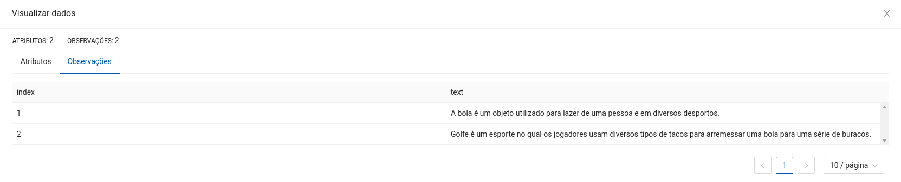
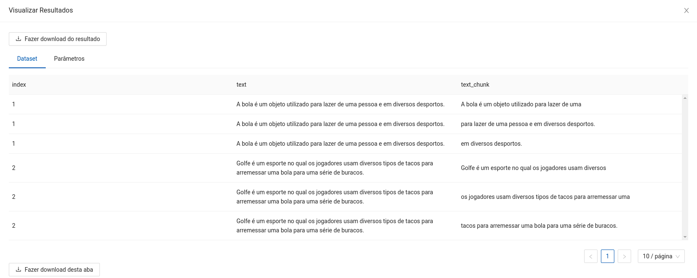

author: Lucas Nunes Sequeira
summary: Chunker
id: translator
categories: platiagro
environments: Web
status: Published
feedback link: https://github.com/platiagro/tutorials

# Chunker

## Função do componente

Separação de textos em partes menores, mantendo uma porção de sobreposição.

* Neste exemplo a aplicação do Chunker é feita separando as expressões considerando as palavras, mas também pode ser realizada considerando períodos.
* No exemplo são considerados os parâmetros `Chunk Size` e `Chunk Overlap` sendo 10 e 4, respectivamente.

## Entrada esperada

Espera-se como entrada para o componente uma tabela com uma coluna de interesse para a aplicação do Chunker, em que cada campo corresponde a um texto que será quebrado em partes menores.

## Parâmetros

A seguir são listados todos os parâmetros utilizados pelo componente:

- **Coluna para aplicar o Chunker**: `string` (Obrigatório). 
<em>Esta coluna será utilizada para criar os chunks de textos. Deve ser uma coluna existente do dataset.</em>

- **Coluna para salvar os chunks gerados**: `string` (Obrigatório). 
<em>Esta coluna será utilizada para salvar os chunks de textos. Deve ser uma coluna inexistente do dataset.</em>

- **Chunkenizer**: `string`, {`"word"`, `"sentence"`}, padrão: `"word"` (Obrigatório). 
<em>Tipo de chunkenizer para aplicar nos dados; `"word"` separa textos em palavras, `"sentence"` separa em sentenças.</em>

- **Chunk Size**: `integer`, padrão: `96` (Obrigatório). 
<em>Tamanho das janelas criadas pelo Chunker.</em>

- **Chunk Size**: `integer`, padrão: `64` (Obrigatório). 
<em>Tamanho da sobreposição das janelas criadas pelo Chunker.</em>

- **Replicar Dados**: `string`, {`"sim"`, `"não"`}, padrão: `"sim"` (Obrigatório). 
<em>Optando por replicar os dados, para cada chunk criado a partir de um campo de texto de uma linha da tabela, todos os dados dessa linha serão replicados de acordo com a quantidade de chunks produzidos.</em>

## Retorno esperado na experimentação

O retorno durante a experimentação ajuda o usuário a analisar tanto métricas distintas de forma visual, como a distribuição dos dados e os dados brutos ao final da execução. Sendo assim, é possível visualizar diversos retornos para este componente como os listados a seguir:

1. Dataframe com o texto de entrada e os chunks produzidos (Replicando os dados).

2. Dataframe com o texto de entrada e os chunks produzidos (Sem replicar os dados).

## Retorno esperado na implantação

Espera-se como retorno numpy arrays contendo a mesma estrutura dos dados de entrada com uma coluna extra correspondente aos chunks produzidos.