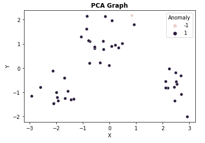

author: Gabriela Correia Vechini
summary: Detecção de Anomalias por Isolation Forest
id: isolation-forest-clustering
categories: platiagro
environments: Web
status: Published
feedback link: https://github.com/platiagro/tutorials

# Detecção de Anomalias por Isolation Forest

### Função do componente

Este é um componente que treina um modelo Isolation Forest usando [Scikit-learn](https://scikit-learn.org/stable/modules/generated/sklearn.ensemble.IsolationForest.html).  
Scikit-learn é uma biblioteca open source de machine learning que suporta apredizado supervisionado e não supervisionado. Também provê várias ferramentas para ajustes de modelos, pré-processamento de dados, seleção e avaliação de modelos, além de outras funcionalidades.

### Entrada esperada

Espera-se como entrada para o componente uma tabela com colunas que representam valores numéricos ou categóricos.

### Parâmetros

Na tabela abaixo, observamos os parâmetros necessários para que o componente funcione da maneira correta:

| Parâmetro     | Tipo     | Opções        | Descrição                                           |
|:-------------|:--------:|:-------------:|:-----------------------------------------------------|
|Quantidade máxima de amostras|`number`| - |O número de amostras máximo a serem retiradas dos dados para treinar cada estimador de base.|
|Contaminação|`number`| - |A quantidade de contaminação do conjunto de dados, ou seja, a proporção de outliers no conjunto de dados.|
|Quantidade máxima de características|`number`| - |O número de características máximo a serem retiradas dos dados para treinar cada estimador de base.|

### Retorno esperado no experimento

1. Gráfico de PCA:

### Retorno esperado na implantação

Tabela com os valores preditos para o atributo alvo.