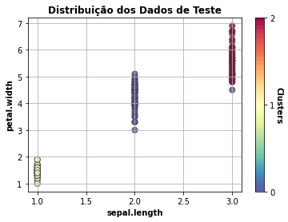

author: Gabriela Correia Vechini
summary: Clusterização Kmeans
id: kmeans-clustering
categories: platiagro
environments: Web
status: Published
feedback link: https://github.com/platiagro/tutorials

# Clusterização Kmeans

## Visão Geral
Duration: 0:05:00

### Função do componente

Este é um componente que treina um modelo K-Means usando [Scikit-learn](https://scikit-learn.org/stable/modules/generated/sklearn.cluster.KMeans.html).  
Scikit-learn é uma biblioteca open source de machine learning que suporta apredizado supervisionado e não supervisionado.Também provê várias ferramentas para ajustes de modelos, pré-processamento de dados, seleção e avaliação de modelos, além de outras funcionalidades.

### Entrada esperada

Espera-se como entrada para o componente uma tabela com colunas que representam valores numéricos ou categóricos.

### Parâmetros

Na tabela abaixo, observamos os parâmetros necessários para que o componente funcione da maneira correta:

| Parâmetro     | Tipo     | Opções        | Descrição                                           |
|:-------------|:--------:|:-------------:|:-----------------------------------------------------|
|Quantidade de clusters|`number`| - |O KMeans utiliza uma quantidade K de clusters para separar os dados.|
|Quantidade de sementes|`number`| - |Número de vezes que o algoritmo será executado com diferentes sementes de centróide.|
|Número de iterações|`number`| - |Número máximo de iterações do algoritmo em uma única execução.|

### Métricas de performance

1. Escore de Silhouette: Avalia a qualidade dos clusters criados usando algoritmos de clustering em termos de quão bem as amostras são agrupadas com outras amostras semelhantes entre si.

### Retorno esperado no experimento

1. Dados de teste:

1. Tabela dos dados:

### Retorno esperado na implantação

Tabela com os valores preditos para o atributo alvo.