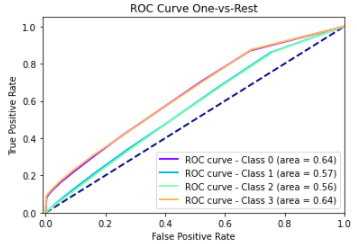

author: Matheus Gustavo Alves Sasso
summary: Classificador Random Forest
id: random-forest-classifier
categories: platiagro
environments: Web
status: Published
feedback link: https://github.com/platiagro/tutorials

# Classficador Random Forest

## Visão Geral
Duration: 0:05:00

### Função do componente

Este componente treina um modelo Random Forest para classificação usando [Scikit-learn](https://scikit-learn.org/stable/modules/generated/sklearn.ensemble.RandomForestClassifier.html).  
Scikit-learn é uma biblioteca open source de machine learning que suporta apredizado supervisionado e não supervisionado. Também provê várias ferramentas para montagem de modelo, pré-processamento de dados, seleção e avaliação de modelos, e muitos outros utilitários.

### Entrada esperada

Espera-se como entrada para o componente uma tabela com colunas que representam valores numéricos ou categóricos.

### Parâmetros

Na tabela abaixo, observamos os parâmetros necessários para que o componente funcione da maneira correta:

| Parâmetro     | Tipo     | Opções        | Descrição                                           |
|:-------------|:--------:|:-------------:|:-----------------------------------------------------|
| Atributo alvo     | `feature` | - | Seu modelo será treinado para prever os valores do alvo. |
| Modo de seleção das features   | `string` |`"incluir"` `"remover"`| Se deseja informar quais features deseja incluir no modelo, selecione a opção 'incluir'. Caso deseje informar as features que não devem ser utilizadas, selecione 'remover'.  |
|Features para incluir/remover no modelo|`feature`| - |Seu modelo será feito considerando apenas as features selecionadas. Caso nada seja especificado, todas as features serão utilizadas|
|Features para fazer codificação ordinal|`feature`| - |Seu modelo utilizará a codificação ordinal para as features selecionadas. As demais features categóricas serão codificadas utilizando One-Hot-Encoding.|
|Estimadores|`integer`| - |Número de árvores na floresta.|
|Critério|`string`| `"gini"` `"entropy"` |Função para medir a qualidade de uma divisão.|
|Profundidade|`integer`| - |O máximo de profundidade da árvore.|
|Features|`string`| `"auto"`  `"sqrt"` `"log2"`|O máximo de features a serem considerados ao procurar a melhor divisão.|
|Peso das Classes|`string`| `"balanced"` `"balanced_subsample"`|Especifica pesos de amostras quando for ajustar classificadores como uma função da classe do target.|
|Método de Predição|`string`| `"predict_proba"` `"predict"` |Se optar por 'predict_proba', o método de predição será a probabilidade estimada de cada classe, já o 'predict' prediz a qual classe pertence.|

### Métricas de performance

1. Acurácia: Indica uma performance geral do modelo. Dentre todas as classificações, quantas o modelo classificou corretamente.
2. Recall: Dentre todas as situações de classe positivo como valor esperado, quantas estão corretas.
3. F1-Score: Média harmônica entre precisão e recall.
4. Suporte: Número de ocorrências de cada classe esperadas
5. Matriz de confusão: Tabela que mostra as frequências de classificação para cada classe do modelo

### Retorno esperado no experimento

1. Matriz de confusão:

1. Curva ROC:

### Retorno esperado na implantação

Tabela com os valores preditos para o atributo alvo.
