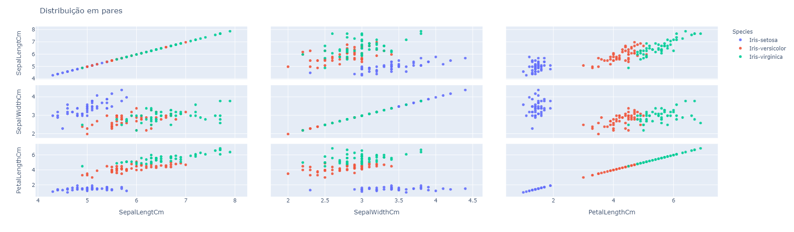

author: Lucas Nunes Sequeira
summary: Scatter Matrix
id: scatter-matrix
categories: platiagro
environments: Web
status: Published
feedback link: https://github.com/platiagro/tutorials


# Scatter Matrix

## Função do componente

Este componente constrói uma representação matricial, na qual cada célula contém um gráfico de dispersão para um determinado par de atributos. Para tanto, é utilizada a biblioteca [Plotly Express](https://plotly.com/python/plotly-express/) que permite a construção de elementos gráficos interativos. Este componente é interessante para analisar como dois atributos se relacionam entre si dentro de um banco de dados.

## Entrada esperada

Espera-se como entrada para o componente uma tabela com colunas que representam valores numéricos, categóricos ou de data. A tabela deve ser de um dos seguintes tipos: Comma-separated values (.csv) ou Excel (.xls, .xlsx).

## Parâmetros

A seguir são listados todos os parâmetros utilizados pelo componente:

- **Atributo alvo (opcional)**: `feature`.<br>
<em>Você visualizará como as demais variáveis se distribuem quando coloridas por este atributo. Este valor é opcional, caso nada seja especificado, todos os pontos dos gráficos terão a mesma coloração.</em>


- **Features para incluir na visualização**: `feature`.<br>
<em>As features selecionadas serão utilizadas para criar as visualizações em pares. Caso nada seja especificado, todas as features serão utilizadas.</em>


## Retorno esperado no experimento

O retorno durante a experimentação ajuda o usuário a analisar como os atributos se relacionam entre si, auxiliando na visualização dos dados de uma maneira geral possibilitando insights para o processo de processamento de dados e treinamento de modelos de aprendizado de máquina.

1. Scatter Matrix. <br> <em>Os gráficos gerados pelo componente representam como os dados da tabela estão relacionados entre pares de atributos, além disso, quando coloridos por um atributo alvo. Cada ponto nos gráficos representa um ponto da tabela de dados, e nos eixos horizontais e verticais seus valores, e os atributos a qual faz referência.</em>



<br>

**Dicas para interpretação:**
<br><br>
<em>Uma maneira de interpretar esses gráficos é analisar quão correlacionados dois atributos são, para isso precisamos identificar padrões. Veja no retângulo em roxo (1.), em que observamos que quanto maior é o valor do atributo ```PetalLengthCM```, também é maior o valor do atributo ```SepalLengthCM```.</em><br><br>
<em>Além disso, selecionar um atributo para colorir os dados também nos permite entender como os dados podem se agrupar de diferentes formas de acordo com um par de atributos. Por exemplo no círculo em roxo (2.), observamos que há uma região onde todos os pontos percencem à ```Species``` (aributo alvo) Iris-setosa, já no círculo roxo (3.), há uma nuvem com mais de uma ```Species```.</em>