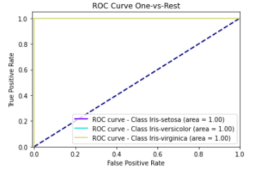

# Simulate Annealing

### Função do componente

Este é um componente que usa uma técnica chamada Simulated Annealing para executar a AutoFeaturing.

### Entrada esperada

Espera-se como entrada para o componente uma tabela com colunas que representam valores numéricos.

### Parâmetros

Na tabela abaixo, observamos os parâmetros necessários para que o componente funcione da maneira correta:

| Parâmetro     | Tipo     | Opções        | Descrição                                           |
|:-------------|:--------:|:-------------:|:-----------------------------------------------------|
| Atributo alvo     | `feature` | - | Seu modelo será treinado para prever os valores do alvo. |
| Coluna de data  | `feature` | - | Coluna com data que será utilizada para extrair novas características.|
| Colunas para agrupar  | `feature` | - | CColunas que serão utilizadas para agrupar e extrair novas características.|
| Alpha  | `integer` | - | Parâmetro para aumentar ou diminuir a busca por soluções.|

### Métricas de performance

1. Acurácia: Indica uma performance geral do modelo. Dentre todas as classificações, quantas o modelo classificou corretamente.
2. Recall: Dentre todas as situações de classe positivo como valor esperado, quantas estão corretas.
3. F1-Score: Média harmônica entre precisão e recall.
4. Suporte: Número de ocorrências de cada classe esperadas
5. Matriz de confusão: Tabela que mostra as frequências de classificação para cada classe do modelo

### Retorno esperado no experimento

1. Matriz de confusão:

2. Curva ROC:

### Retorno esperado na implantação

Tabela com os valores preditos para o atributo alvo.
