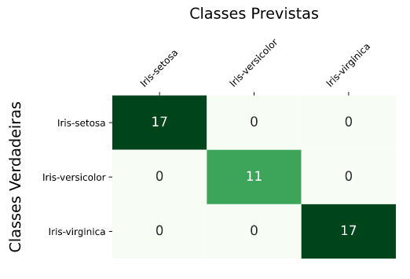

author: Gabriela Correia Vechini
summary: Classificador SVM
id: svc
categories: platiagro
environments: Web
status: Published
feedback link: https://github.com/platiagro/tutorials

# Classificador SVM

## Visão Geral
Duration: 0:05:00

### Função do componente

Este componente treina um modelo Support Vector Classification usando [Scikit-learn](https://scikit-learn.org/stable/modules/generated/sklearn.svm.SVC.html).  
Scikit-learn é uma biblioteca open source de machine learning que suporta apredizado supervisionado e não supervisionado. Também provê diversas ferramentas para montagem de modelo, pré-processamento de dados, seleção e avaliação de modelos, e muitos outros utilitários.

### Entrada esperada

Espera-se como entrada para o componente uma tabela com colunas que representam valores numéricos ou categóricos.

### Parâmetros

Na tabela abaixo, observamos os parâmetros necessários para que o componente funcione da maneira correta:

| Parâmetro     | Tipo     | Opções        | Descrição                                           |
|:-------------|:--------:|:-------------:|:-----------------------------------------------------|
| Atributo alvo     | `feature` | - | Seu modelo será treinado para prever os valores do alvo. |
| Modo de seleção das features   | `string` |`"incluir"` `"remover"`| Se deseja informar quais features deseja incluir no modelo, selecione a opção 'incluir'. Caso deseje informar as features que não devem ser utilizadas, selecione 'remover'.  |
|Features para incluir/remover no modelo|`feature`| - |Seu modelo será feito considerando apenas as features selecionadas. Caso nada seja especificado, todas as features serão utilizadas|
|Features para fazer codificação ordinal|`feature`| - |Seu modelo utilizará a codificação ordinal para as features selecionadas. As demais features categóricas serão codificadas utilizando One-Hot-Encoding.|
|Kernel|`string`| `"linear"` `"poly"` `"rbf"` `"sigmoid"` `"precomputed"`|Especifica o tipo de kernel a ser usado no algoritmo.|
|Grau|`number`| - |Grau da função polinomial do kernel ('poly'). Ignorado por outros kernels.|
|Gama|`string`| `"scale"` `"auto"`|Coeficiente de kernel para 'rbf', 'poly' e 'sigmoid'.|
|Regularização|`number`| - |A força da regularização é inversamente proporcional a C. Deve ser positivo. Penalidade é l2².|
|Iteração|`number`| - |Limite fixo nas iterações no solver, ou -1 sem limite.|
|Probabilidade|`boolean`| `True`  `False`|Se é necessário ativar estimativas de probabilidade.  Deve ser ativado antes da chamada fit() do modelo, reduzirá a velocidade desse método, pois ele usa internamente o 5-fold-cross-validation, e predict_proba pode ser inconsistente com a chamada predict().|
|Método de Predição|`string`| `"predict_proba"` `"predict"`|Se optar por 'predict_proba', o método de predição será a probabilidade estimada de cada classe, já o 'predict' prediz a qual classe pertence.|

### Métricas de performance

1. Acurácia: Indica uma performance geral do modelo. Dentre todas as classificações, quantas o modelo classificou corretamente.
2. Recall: Dentre todas as situações de classe positivo como valor esperado, quantas estão corretas.
3. F1-Score: Média harmônica entre precisão e recall.
4. Suporte: Número de ocorrências de cada classe esperadas
5. Matriz de confusão: Tabela que mostra as frequências de classificação para cada classe do modelo

### Retorno esperado no experimento

1. Matriz de confusão:

2. Dados de teste:

3. Curva ROC:

4. Tabela dos dados:

### Retorno esperado na implantação

Tabela com os valores preditos para o atributo alvo.