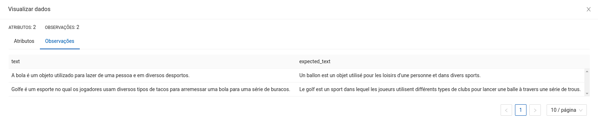
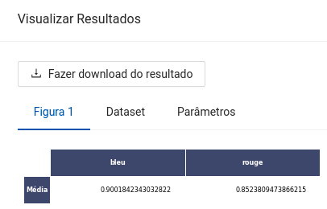

author: Lucas Nunes Sequeira
summary: Translator
id: translator
categories: platiagro
environments: Web
status: Published
feedback link: https://github.com/platiagro/tutorials

# Tradutor

## Função do componente

Utilização de modelos do tipo [MarianMT](https://huggingface.co/transformers/model_doc/marian.html) para tradução.

* Neste exemplo a tradução é feita do português para o francês, mas ela pode ser feita em qualquer um dos pares de idiomas disponíveis no componente.
* As métricas computada são o [BLEU](https://en.wikipedia.org/wiki/BLEU) e o [ROUGUE](https://en.wikipedia.org/wiki/ROUGE_(metric)).

## Entrada esperada

Espera-se como entrada para o componente uma tabela com uma coluna de interesse para tradução, em que cada campo corresponde a um texto que será traduzido.

## Parâmetros

A seguir são listados todos os parâmetros utilizados pelo componente:

- **Coluna para aplicar o Tradutor**: `string` (Obrigatório). 
<em>Esta coluna será utilizada para traduzir os textos. Deve ser uma coluna existente do dataset.</em>

- **Coluna para salvar os textos traduzidos**: `string` (Obrigatório). 
<em>Esta coluna será utilizada para salvar as traduções dos textos. Deve ser uma coluna inexistente do dataset.</em>

- **Coluna para avaliar os textos traduzidos**: `string` (Opcional). 
<em>Esta coluna será utilizada para avaliar as traduções dos textos. É uma coluna opcional.</em>

- **Idioma Fonte**: `string`, {`"africâner"`, `"alemão"`, `"árabe"`, `"catalão"`, `"chinês"`, `"dinamarquês"`, `"espanhol"`, `"francês"`, `"frísio"`, `"holandês"`, `"híndi"`, `"inglês"`, `"islandês"`, `"italiano"`, `"japonês"`, `"latim"`, `"norueguês"`, `"português"`, `"romeno"`, `"sueco"`, `"zulu"`}, padrão: `"português"` (Obrigatório). 
<em>Idioma dos dados de entrada.</em>

- **Idioma Alvo**: `string`, {`"africâner"`, `"alemão"`, `"árabe"`, `"catalão"`, `"chinês"`, `"dinamarquês"`, `"espanhol"`, `"francês"`, `"frísio"`, `"holandês"`, `"híndi"`, `"inglês"`, `"islandês"`, `"italiano"`, `"japonês"`, `"latim"`, `"norueguês"`, `"português"`, `"romeno"`, `"sueco"`, `"zulu"`}, padrão: `"inglês"` (Obrigatório). 
<em>Idioma dos dados de saída. Deve ser um idioma diferente do Idioma Fonte.</em>

- **Dispositivo**: `string`, {`"cuda"`, `"cpu"`}, padrão: `"cuda"` (Obrigatório). 
<em>Tipo de dispositivo para efetuar as traduções. Caso selecionado a opção `"cuda"` e ela não estiver disponível na máquinal, automaticamente será transferido para `"cpu"`.</em>

- **Batch Size**: `integer`, padrão: `4` (Obrigatório). 
<em>Tamanho dos lotes de dados para tradução.</em>

## Métricas de performance

As métricas de performance tem o propósito de ajudar o usuário a avaliar a performance do modelo. Essas métricas variam de acordo com o tipo de problema, tal como: classificação, regressão, agrupamento, entre outros.

1. BLEU: A métrica BLEU (cujo nome provém de BiLingual Evaluation Understudy) mede a precisão dos n-gramas das sentenças alvo geradas automaticamente em relação a um conjunto de textos de referência

2. ROUGUE-L: A métrica ROUGUE (cujo nome provém de Recall-Oriented Understudy for Gisting Evaluation) identifica a co-ocorrência das substrings mais longas definidas por n-gramas entre as sentenças alvo geradas automaticamente e um conjunto de textos de referência.

## Retorno esperado na experimentação

O retorno durante a experimentação ajuda o usuário a analisar tanto métricas distintas de forma visual, como a distribuição dos dados e os dados brutos ao final da execução. Sendo assim, é possível visualizar diversos retornos para este componente como os listados a seguir:

1. Dataframe com o texto de entrada, texto de referência (opcional) e o texto traduzido.

2. Uma tabela com a pontuação obtida para cada texto pelas métricas BLEU e ROUGUE-L caso seja informado a coluna de avaliação.

## Retorno esperado na implantação

Espera-se como retorno numpy arrays contendo a mesma estrutura dos dados de entrada com uma coluna extra correspondente aos textos traduzidos.