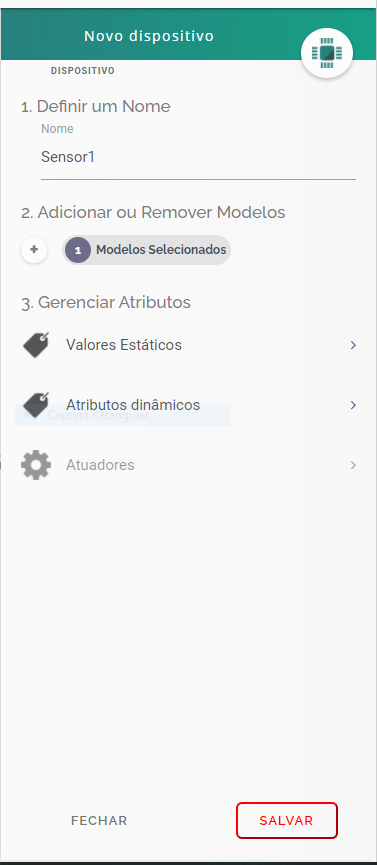
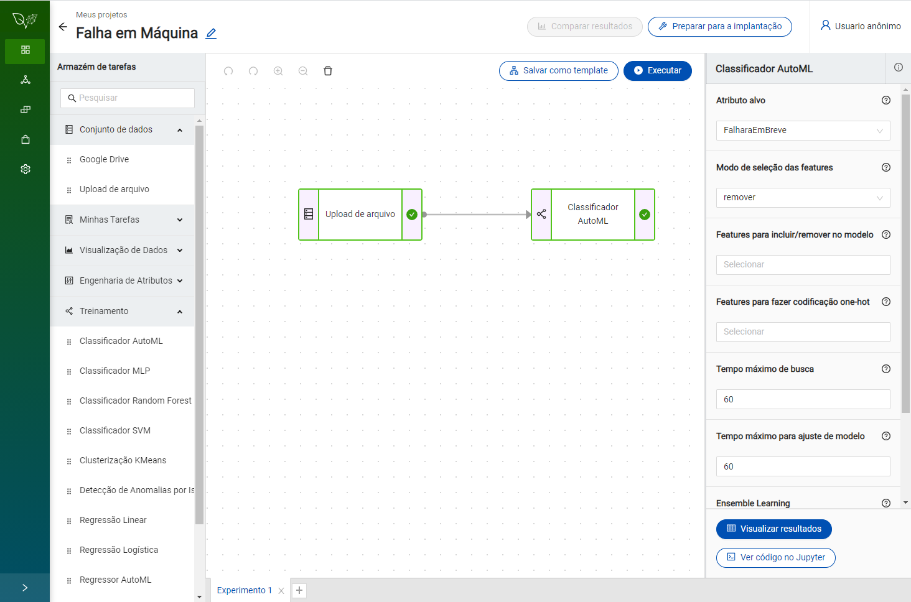

author: Fabio Beranizo Fontes Lopes
summary: AI + IoT com PlatIAgro e dojot
id: platiagro-dojot
categories: platiagro
environments: Web
status: Published
feedback link: https://github.com/platiagro/tutorials

# AI + IoT com PlatIAgro e dojot

## Introdução
Duration: 0:01:00

### **O Que Você Vai Aprender**

* Como usar a plataforma dojot para capturar dados de sensores IoT
* Como construir um modelo para predição de falha utilizando dados capturados pela dojot
* Como enviar os dados da dojot para um fluxo implantado na PlatIAgro
* Como conectar uma aplicação à solução de AI + IoT

### **Do Que Você Precisa Para Este Tutorial**

* Um ambiente com a PlatIAgro e dojot prontas para uso.

## Configure dispositivos “sensor” e “máquina” na dojot
Duration: 0:15:00

Positive
: Vamos adicionar modelos e dispositivos à dojot **para capturar dados de sensores e, posteriormente, utilizá-los na PlatIAgro**. Para iniciar a configuração, acesse a plataforma dojot e realize o login.

### **Crie um Novo Modelo “Sensor”**

1. No menu lateral, selecione o item **Modelos - Gerenciamento de modelos**.

1. Clique no botão **Novo Modelo +**, preencha com o nome **“Sensor”**.

1. Adicione novos atributos:
   - Nome do atributo: **Maquina**
     Tipo de atributo: Valor estático
     Tipo de valor: Texto
     Valor: Minerva
   - Nome do atributo: **Data**
     Tipo de atributo: Valor dinâmico
     Tipo de valor: Texto
   - Nome do atributo: **Temperatura**
     Tipo de atributo: Valor dinâmico
     Tipo de valor: Inteiro
   - Nome do atributo: **Umidade**
     Tipo de atributo: Valor dinâmico
     Tipo de valor: Inteiro
   - Nome do atributo: **Vibracao1**
     Tipo de atributo: Valor dinâmico
     Tipo de valor: Inteiro
   - Nome do atributo: **Vibracao2**
     Tipo de atributo: Valor dinâmico
     Tipo de valor: Inteiro
   - Nome do atributo: **Vibracao3**
     Tipo de atributo: Valor dinâmico
     Tipo de valor: Inteiro
   - Nome do atributo: **Vibracao4**
     Tipo de atributo: Valor dinâmico
     Tipo de valor: Inteiro
   - Nome do atributo: **Vibracao5**
     Tipo de atributo: Valor dinâmico
     Tipo de valor: Inteiro
   - Nome do atributo: **Vibracao6**
     Tipo de atributo: Valor dinâmico
     Tipo de valor: Inteiro
   - Nome do atributo: **HorasDesdeAUltimaFalha**
     Tipo de atributo: Valor dinâmico
     Tipo de valor: Inteiro

1. Clique no botão **Salvar**

### **Crie um Novo Dispositivo “Sensor1”**

1. No menu lateral, selecione o item **Dispositivos - Dispositivos e configurações**.

1. Clique no botão **Novo Dispositivo +**, preencha com o nome **“Sensor1”**.

1. Selecione o modelo **Sensor**

1. Clique no botão **Salvar**

Positive
: Os dados capturados por este dispositivo serão utilizados em um modelo de predição de falha, implantado na PlatIAgro.

### **Crie um Novo Modelo “Maquina”**

1. No menu lateral, selecione o item **Modelos - Gerenciamento de modelos**.

1. Clique no botão **Novo Modelo +**, preencha com o nome **“Maquina”**.

1. Adicione novos atributos:
   - Nome do atributo: **Maquina**
     Tipo de atributo: Valor estático
     Tipo de valor: Texto
     Valor: Minerva
   - Nome do atributo: **FalharaEmBreve**
     Tipo de atributo: Valor dinâmico
     Tipo de valor: Float

1. Clique no botão **Salvar**

### **Crie um Novo Dispositivo “Minerva”**

1. No menu lateral, selecione o item **Dispositivos - Dispositivos e configurações**.

1. Clique no botão **Novo Dispositivo +**, preencha com o nome **“Minerva”**.

1. Selecione o modelo **Maquina**

1. Clique no botão **Salvar**

### **Muito bem! A dojot já está pronta para receber os dados de sensores IoT. No próximo passo iremos construir um modelo de predição de falhas na PlatIAgro.**

## Construa um modelo para predição de falhas na PlatIAgro
Duration: 0:15:00

Positive
: Vamos construir um modelo para predição de falha e **prepará-lo para um fluxo em tempo-real, utilizando dados de dispositivos da dojot**. Para iniciar a configuração, acesse a PlatIAgro.

### **Crie um Novo Projeto**

Para dar início a um projeto, clique no botão **“Novo Projeto”**, localizado acima da lista de projetos. 
Ao clicar no botão será aberto um formulário onde é possível informar um nome e descrição.

### **Construa um Fluxo de Tarefas**

Após criar um novo projeto, será possível experimentar vários fluxos de tarefas, seja para o treinamento de modelos ou visualização de resultados. 
Posteriormente, será possível decidir qual deles seguirá para implantação.

Negative
: Faça download do conjunto de dados **[Falha em Máquinas Agrícolas](https://raw.githubusercontent.com/platiagro/tutorials/master/codelabs/platiagro-dojot/datasets/FalhaEmMaquinasAgricolas.csv)**.

1. No **“Armazém de tarefas”**, dentro do grupo **“Conjunto de dados”**, arraste a tarefa **“Upload de arquivo”** para o painel central.

1. No **“Armazém de tarefas”**, dentro do grupo **“Treinamento”**, arraste a tarefa **“Classificador AutoML”** para o painel central.

1. No painel central, selecione a tarefa **Upload de arquivo”**. Os detalhes da tarefa irão aparecer à direita.

1. Clique no botão **“Selecionar”** e escolha o arquivo **“FalhaMaquinasAgricolas.csv”**, obtido no passo anterior. 

1. Clique no botão **“Importar”** e importe o arquivo FalhaEmMaquinasAgricolas.csv.

1. No painel central, selecione a tarefa **“Classificador AutoML”**. Os detalhes da tarefa irão aparecer à direita.

1. Selecione o **“Atributo alvo”**: **“FalharaEmBreve”**

### **Executar Fluxo de Experimentação**

Clique no botão **“Executar”**, a seguinte mensagem será exibida: “Executando o fluxo”

Quando a execução do fluxo for concluída com sucesso, **as tarefas ficarão destacadas em verde**.

### **Faça a Implantação do Fluxo de Experimentação**

No painel do experimento, clique no botão **Preparar para a implantação**.

### **Você será direcionado à página de fluxos implantados.**

### **Muito bem! A PlatIAgro já está pronta para realizar predições com os dados coletados pela dojot. No próximo passo iremos conectar dojot e PlatIAgro.**

## Conecte os sensores da dojot à um fluxo da PlatIAgro
Duration: 0:05:00

Negative
: TODO

## Conecte uma aplicação dashboard à dojot e à PlatIAgro
Duration: 0:05:00

Vamos conectar um dashboard ao modelo implantado.

1. Acesse a [aplicação dashboard](https://platiagro.github.io/tutorials/machine-failure-dojot/)

1. Clique em **Informar**, preencha a URL e Dispositivos e clique em OK.

### **Aguarde uns instantes, e então você verá as informações de sensores e probabilidades de falha retornadas pelo modelo.**

### **Parabéns! Você construiu um fluxo AI + IoT com PlatIAgro e dojot.**

### **Próximos Passos**

* Crie uma Tarefa na PlatIAgro
* Conheça as Tarefas Nativas da PlatIAgro
