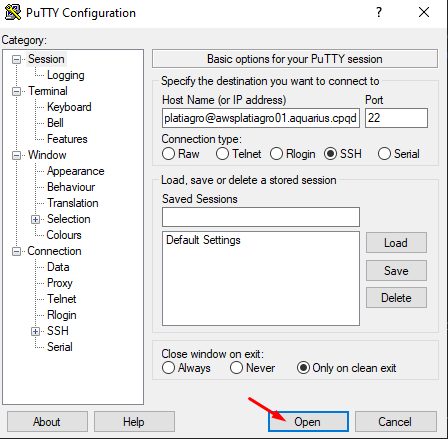

author: Matheus Gustavo Alves Sasso
summary: Tutorial de uso da GPU
id: user-tutorial
categories: platiagro
environments: Web
status: Published
feedback link: https://github.com/platiagro/tutorials

# Tutorail de Utilização

## Visão Geral
Duration: 0:05:00


### Ligando a GPU
Primeiramente ,para ligar o ambiente com GPU é necessário acessar o [auto-atendimento](https://autoatendimento.cpqd.com.br/job/AWS/job/Inicia%20inst%C3%A2ncia%20spot%20Platiagro/build?delay=0sec). Feito isso, você será redirecionado para a págia com os campos abaixo:


Nos campos Nome e Regiao, preencher como mostrado abaixo e clicar em costruir.
*   Nome: awsplatiagro01
*   Regiao: ap-northeast-1


Feito isso é necessário esperar cerca de 1 minuto. E a GPU poderá ser acessada.

### Acessando a GPU

Para entrar no ambiente com GPU basta acessar o ambiente [awspltiagro01](https://awsplatiagro01/)


### Desligando a GPU

Primeiramente, para desligar a GPU é necessário realizar um comando SSH na máquina AWS com os seguintes parâmetros:

*   Host Name: platiagro@awsplatiagro01.aquarius.cpqd.com.br
*   Port: 22
*   Senha: usuario

Uma maneira de fazer isso é utilizando o putty, como mostra a imagem a seguir:




Após incluir a senha, observa-se a tela:


Por último é necessário incluir o comando:

```bat

sudo shutdown -P now
```


Após incluir a senha, a mensagem abaixo deverá aparecer. Se isso acontecer, a GPU foi desligada com sucesso!


