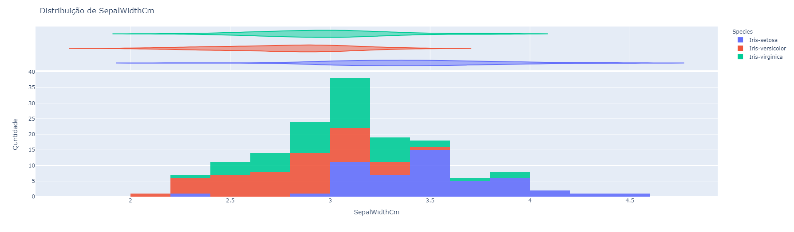
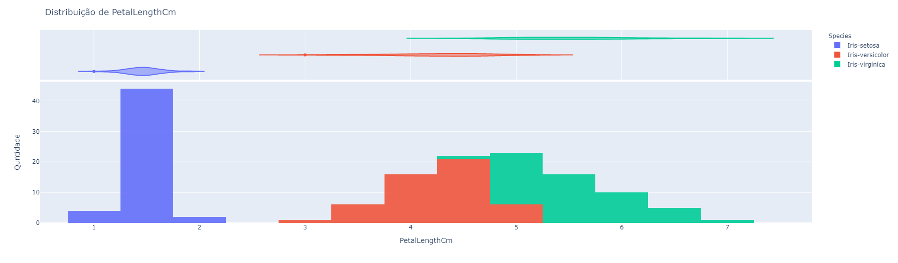

author: Lucas Nunes Sequeira
summary: Distribuição dos Dados
id: data-distribution
categories: platiagro
environments: Web
status: Published
feedback link: https://github.com/platiagro/tutorials
tags: platiagro-tasks

# Distribuição dos Dados

## Função do componente

Este componente produz gráficos de distribuição dos dados. Para isso, é utilizada a biblioteca [Plotly Express](https://plotly.com/python/plotly-express/) que permite a construção de elementos gráficos interativos. Este componente permir analisar como os valores de um (ou mais) determinado atributo estão distribuídos na tabela de dados.

## Entrada esperada

Espera-se como entrada para o componente uma tabela com colunas que representam valores numéricos, categóricos ou de data. A tabela deve ser de um dos seguintes tipos: Comma-separated values (.csv) ou Excel (.xls, .xlsx).

## Parâmetros

A seguir são listados todos os parâmetros utilizados pelo componente:

- **Atributo alvo (opcional)**: `feature`. 
<em>Você visualizará como as demais variáveis se distribuem quando coloridas por este atributo. Este valor é opcional, caso nada seja especificado, todos os pontos dos gráficos terão a mesma coloração.</em>

- **Features para visualizar**: `feature`. 
<em>As features selecionadas serão utilizadas para criar gráficos individuais de distribuição de dados de cada uma. Caso nada seja especificado, todas as features serão utilizadas.</em>

- **Distribuição marginal**: `string`. 
<em>É a forma de vizualização da sumarização da distribuição dos dados, isto reflete no layout dos gráficos.</em>

## Retorno esperado no experimento

O retorno durante a experimentação ajuda o usuário a analisar como os valores para cada atributo se distribuem nos dados da tabela, auxiliando na visualização dos dados de uma maneira geral possibilitando insights para o processo de processamento de dados e treinamento de modelos de aprendizado de máquina.

1. Distribuição dos Dados.   <em>Os gráficos gerados pelo componente representam como os dados da tabela estão distribuídos, além disso, quando coloridos por um atributo alvo. Para cada atributo selecionado, é gerado um gráfico único. Cada retângulo, das figuras, representa a quantidade de dados com as características do intervalo representado no eixo horizontal.</em>

    1. Atributo 1  
    

    2. Atributo 2  
    