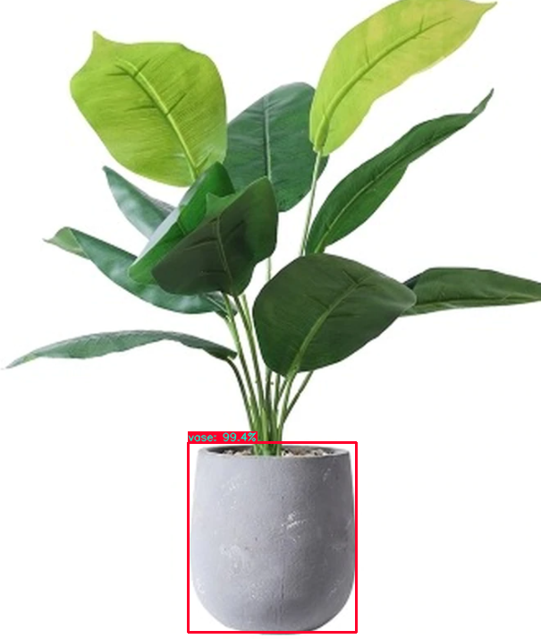

author: Lucas Zanco Ladeira
summary: Detecção de Objetos
id: default-yolo
categories: platiagro
environments: Web
status: Published
feedback link: https://github.com/platiagro/tutorials
tags: platiagro-tasks

# Detecção de Objetos

## Função do componente

Este componente utiliza o algoritmo Yolo para detecção e classificação de objetos em imagens implementado na biblioteca [Yolov4](https://pypi.org/project/yolov4/). Essa biblioteca utiliza uma versão do modelo treinado com a base de dados Coco, e portanto, reconhece os objetos descritos em coco.names.

## Entrada esperada

Espera-se como entrada para o componente um arquivo .zip com imagens.

## Parâmetros

A seguir são listados todos os parâmetros utilizados pelo componente:

- **Linguagem**: `string`, {`"português"`, `"inglês"`}, padrão: `"português"`. 
<em>O objeto detectado pode estar em português ou inglês.</em>

## Retorno esperado na experimentação

O retorno durante a experimentação ajuda o usuário a analisar tanto métricas distintas de forma visual, como a distribuição dos dados e os dados brutos ao final da execução. Sendo assim, é possível visualizar diversos retornos para este componente como os listados a seguir:

1. Objetos identificados na imagem, probabilidade de cada objeto, e coordenadas das boundary boxes.

### Retorno esperado na implantação

Objetos identificados na imagem, probabilidade de cada objeto, e coordenadas das boundary boxes.