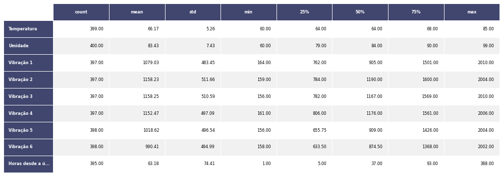

author: Lucas Zanco Ladeira
summary: Descriptive Analysis
id: descriptive-analysis
categories: platiagro
environments: Web
status: Published
feedback link: https://github.com/platiagro/tutorials
tags: platiagro-tasks

# Análise Descritiva

## Função do componente

Este componente realiza a análise descritiva de cada coluna do dataset fornecido. Para colunas numéricas, são calculadas as seguintes estatísticas: count, mean, std, min, max, além dos percentis. Para dados categóricos, por outro lado, calculam-se count, unique, top e freq. O valor de top representa a moda , enquanto freq é a frequência da moda.

## Entrada esperada

Espera-se como entrada para o componente uma tabela com colunas que representam valores numéricos, categóricos ou de data. A tabela deve ser de um dos seguintes tipos: Comma-separated values (.csv) ou Excel (.xls, .xlsx).

## Retorno esperado no experimento

O retorno durante a experimentação ajuda o usuário a analisar tanto métricas distintas de forma visual, como a distribuição dos dados e os dados brutos ao final da execução. Sendo assim, é possível visualizar diversos retornos para este componente como os listados a seguir:

1. Descrição dos dados gerados pelo componente.   <em>Os dados gerados pelo componentes se referem a diferentes variávies estatísticas sobre cada coluna numérica existente nos dados de entrada. </em>
