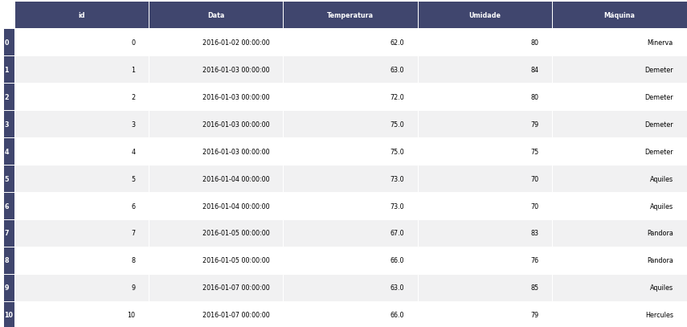

author: Matheus Gustavo Alves Sasso
summary: Feature Tools
id: feature-tools
categories: platiagro
environments: Web
status: Published
feedback link: https://github.com/platiagro/tutorials
tags: platiagro-tasks

# Feature Tools

## Função do componente

Este componente utiliza [Feature Tools](https://www.featuretools.com/) para AutoFeaturing. É feita uma validação para retornar os dados que apresentarem o melhor, sejam eles os dados gerados pelo componente ou os dados iniciais.

## Entrada esperada

Espera-se como entrada para o componente uma tabela com colunas que representam valores numéricos, categóricos ou de data. A tabela deve ser de um dos seguintes tipos: Comma-separated values (.csv) ou Excel (.xls, .xlsx).

## Parâmetros

A seguir são listados todos os parâmetros utilizados pelo componente:

- **Atributo alvo**: `feature` (Obrigatório). 
<em>Esse valor será utilizado para garantir que o alvo não seja removido.</em>

- **Coluna de data**: `feature`. 
<em>Coluna com data que será utilizada para extrair novas características.</em>

- **Colunas para agrupar**: `feature`. 
<em>Colunas que serão utilizadas para agrupar e extrair novas características.</em>

## Retorno esperado na experimentação

O retorno durante a experimentação ajuda o usuário a analisar tanto métricas distintas de forma visual, como a distribuição dos dados e os dados brutos ao final da execução. Sendo assim, é possível visualizar diversos retornos para este componente como os listados a seguir:

1. Tabela dos dados  <em>Apresenta visualização dos dados após o treinamento do modelo com a variável resposta e dados sobre o modelo.</em>

## Retorno esperado na implantação

Dados com novas características criadas ou os dados iniciais se não for possível obter resultado melhor com essa estratégia.
