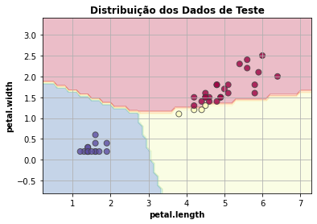
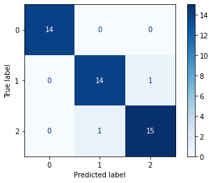
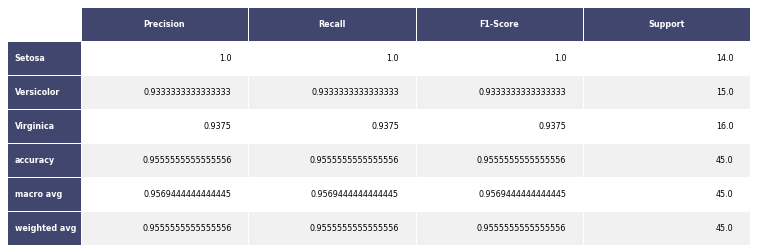
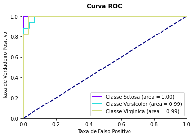

author: Matheus Gustavo Alves Sasso
summary: Regressão Logística
id: logistic-regression
categories: platiagro
environments: Web
status: Published
feedback link: https://github.com/platiagro/tutorials
tags: platiagro-tasks

# Regressão Logística

## Função do componente

Este componente treina um modelo de Regressão Logística para classificação usando [Scikit-learn](https://scikit-learn.org/stable/modules/generated/sklearn.linear_model.LogisticRegression.html). Scikit-learn é uma biblioteca open source de machine learning que suporta apredizado supervisionado e não supervisionado. Também provê várias ferramentas para ajustes de modelos, pré-processamento de dados, seleção e avaliação de modelos, além de outras funcionalidades.

## Entrada esperada

Espera-se como entrada para o componente uma tabela com colunas que representam valores numéricos, categóricos ou de data. Os valores de data devem ser removidos ou selecionados para codificação ordinal para que o modelo consiga processá-los. A tabela deve ser de um dos seguintes tipos: Comma-separated values (.csv) ou Excel (.xls, .xlsx).

## Parâmetros

A seguir são listados todos os parâmetros utilizados pelo componente:

- **Atributo alvo**: `feature` (Obrigatório). 
<em>Seu modelo será treinado para prever os valores do alvo.</em>

- **Modo de seleção das features**: `string`, {`"incluir"`, `"remover"`}, padrão: `"remover"`. 
<em>Se deseja informar quais features deseja incluir no modelo, selecione a opção 'incluir'. Caso deseje informar as features que não devem ser utilizadas, selecione 'remover'.</em>

- **Features para incluir/remover no modelo**: `feature`. 
<em>Seu modelo será feito considerando apenas as features selecionadas. Caso nada seja especificado, todas as features serão utilizadas.</em>

- **Features para fazer codificação ordinal**: `feature`. 
<em>Seu modelo utilizará a codificação ordinal para as features selecionadas. As demais features categóricas serão codificadas utilizando One-Hot-Encoding.</em>

- **Penalidade**: `string`, {`"l1"`, `"l2"`, `"elasticnet"`, `"None"`}, padrão: `"l2"`. 
<em>Norma utilizada na penalização do erro.</em>

- **Regularização Inversa**: `float`, padrão: `"1.0"`. 
<em>Retém a modificação de força da regularização ao ser posicionada inversamente no regulador Lambda.</em>

- **Interceptação**: `boolean`, {`True`, `False`}, padrão: `True`. 
<em>Especifica se uma constante (viés ou interceptação) deve ser adicionada (True) à função de decisão.</em>

- **Peso das Classes**: `string`, {`None`, `"balanced"`, `"balanced_subsample"`}, padrão: `None`. 
<em>Especifica pesos de amostras quando for ajustar classificadores como uma função da classe do target.</em>

- **Solucionador**: `string`, {`"liblinear"`, `"lbfgs"`, `"sgd"`, `"adam"`}, padrão: `"liblinear"`. 
<em>Algoritmo a ser usado no problema de otimização.</em>

- **Iterações**: `integer`, padrão: `100`. 
<em>Número máximo de itereações feitas para os solvers convergirem.</em>

- **Multiclasse**: `string`, {`"auto"`, `"ovr"`, `"multimomial"`}, padrão: `"auto"`. 
<em>Classificação com mais de duas classes, porém cada amostra pode ser rotulada apenas como uma classe.</em>

- **Método de Predição**: `string`, {`"predict_proba"`, `"predict"`}, padrão: `"predict_proba"`. 
<em>Se optar por 'predict_proba', o método de predição será a probabilidade estimada de cada classe, já o 'predict' prediz a qual classe pertence.</em>

- **Gráficos a serem ignorados**: `string`, {`"Dados de Teste"`, `"Matriz de Confusão"`, `"Métricas Comuns"`, `"Curva HOC"`, `"Tabelas de Dados"`}. 
<em>Considerando a quantidade de gráficos que são retornados ao executar a experimentação, o usuário pode selecionar quais ele não deseja visualizar.</em>

## Métricas de performance

As métricas de performance tem o propósito de ajudar o usuário a avaliar a performance do modelo. Essas métricas variam de acordo com o tipo de problema, tal como: classificação, regressão, agrupamento, entre outros.

1. Acurácia: Indica uma performance geral do modelo. Dentre todas as classificações, quantas o modelo classificou corretamente.
1. Recall: Dentre todas as situações de classe positivo como valor esperado, quantas estão corretas.
1. F1-Score: Média harmônica entre precisão e recall.
1. Suporte: Número de ocorrências de cada classe esperadas
1. Matriz de confusão: Tabela que mostra as frequências de classificação para cada classe do modelo

## Retorno esperado na experimentação

O retorno durante a experimentação ajuda o usuário a analisar tanto métricas distintas de forma visual, como a distribuição dos dados e os dados brutos ao final da execução. Sendo assim, é possível visualizar diversos retornos para este componente como os listados a seguir:

1. Dados de teste  <em> Apresenta a distribuição dos dados de teste considerando as duas características mais relevantes para o modelo.</em>

1. Matriz de confusão  <em>Apresenta a matriz de confusão. Cada linha representa uma classe e cada coluna representa a classe predita pelo modelo. Assim, é possível observar relações entre os acertos e erros para cada classe. Na diagonal temos o caso em que a classe predita acertou a classe real.</em>

1. Métricas comuns  <em>Apresenta métricas comuns utilizadas para avaliar modelos de classificação, como por exemplo: precision e recall.</em>

1. Curva ROC  <em>Apresenta um gráfico da Curva ROC. Esse gráfico permite avaliar a performance de um classificador binário para diferentes pontos de cortes. A métrica AUC (Area under curve) também é calculada e indicada na legenda do gráfico. Se a variável resposta tiver mais de duas categorias, o cálculo da curva ROC e AUC é feito utilizando o algoritmo one-vs-rest, ou seja, calcula-se a curva ROC e AUC de cada classe em relação ao restante.</em>

1. Tabela dos dados  <em>Apresenta visualização dos dados após o treinamento do modelo com a variável resposta e dados sobre o modelo.</em>

## Retorno esperado na implantação

O retorno durante a implantação se refere a tabela com os valores preditos para o atributo alvo. Sendo que, cada linha da tabela se refere a um registro enviado ao modelo.
