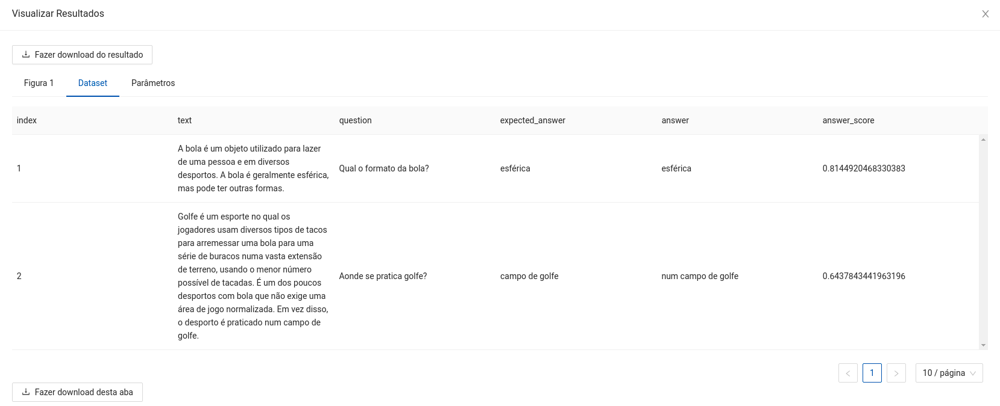
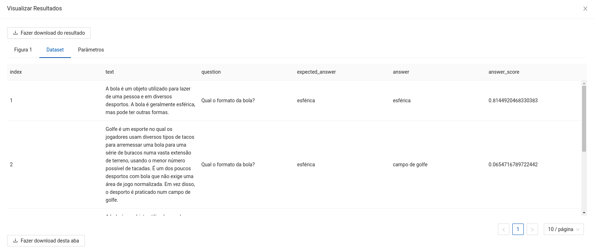
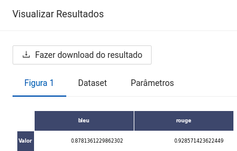

author: Lucas Nunes Sequeira
summary: Reader
id: reader
categories: platiagro
environments: Web
status: Published
feedback link: https://github.com/platiagro/tutorials
tags: platiagro-tasks

# Reader

## Função do componente

Este componente utiliza um modelo de QA (Pergunta e Resposta) pré-treinado em Português com o dataset SQuAD v1.1, é um modelo de domínio público disponível em [Hugging Face](https://huggingface.co/pierreguillou/bert-large-cased-squad-v1.1-portuguese). Seu objetivo é encontrar a resposta de uma ou mais perguntas de acordo com uma lista de contextos distintos.

* Neste exemplo são feitas duas perguntas distintas para dois contextos distintos.
* As métricas computadas são o [BLEU](https://en.wikipedia.org/wiki/BLEU) e o [ROUGUE](https://en.wikipedia.org/wiki/ROUGE_(metric)).
* Observação: Este componente utiliza recursos da internet, portanto é importante estar conectado à rede para que este componente funcione corretamente.

## Entrada esperada

Espera-se como entrada para o componente uma tabela com uma coluna de contextos para a aplicação do QA e uma coluna com as perguntas para serem aplicadas aos contextos.

## Parâmetros

A seguir são listados todos os parâmetros utilizados pelo componente:

- **Coluna dos contextos**: `string` (Obrigatório). 
<em>Esta coluna será utilizada para ler os contextos e aplicar o Reader.</em>

- **Coluna das perguntas**: `string` (Obrigatório). 
<em>Esta coluna será utilizada para identificar as perguntas a serem aplicadas aos contextos.</em>

- **Coluna das respostas**: `string` (Obrigatório). 
<em>Esta coluna será utilizada para gerar a resposta produzida por cada pergunta.</em>

- **Coluna da pontuação das respostas**: `string` (Obrigatório). 
<em>Esta coluna será utilizada para gerar a pontuação de cada resposta produzida.</em>

- **Coluna de avaliação**: `string` (Opcional). 
<em>Esta coluna será utilizada para avaliar as respostas produzidas por cada pergunta, espera-se que nesta coluna estejam as respostas esperadas de cada pergunta em sua respectiva linha na tabela. É uma coluna opcional.</em>

- **Dispositivo**: `string`, {`"cuda"`, `"cpu"`}, padrão: `"cuda"` (Obrigatório). 
<em>Tipo de dispositivo para efetuar as inferências. Caso selecionado a opção `"cuda"` e ela não estiver disponível na máquina, automaticamente será transferido para `"cpu"`.</em>

- **Apenas Melhor Resposta**: `string`, {`"sim"`, `"não"`}, padrão: `"sim"` (Obrigatório). 
<em>Manterá apenas as linhas correspondentes à melhor resposta gerada pelo par pergunta e contexto.</em>

## Métricas de performance

As métricas de performance tem o propósito de ajudar o usuário a avaliar a performance do modelo. Essas métricas variam de acordo com o tipo de problema, tal como: classificação, regressão, agrupamento, entre outros.

1. BLEU: A métrica BLEU (cujo nome provém de BiLingual Evaluation Understudy) mede a precisão dos n-gramas das sentenças alvo geradas automaticamente em relação a um conjunto de textos de referência

2. ROUGUE-L: A métrica ROUGUE (cujo nome provém de Recall-Oriented Understudy for Gisting Evaluation) identifica a co-ocorrência das substrings mais longas definidas por n-gramas entre as sentenças alvo geradas automaticamente e um conjunto de textos de referência.

## Retorno esperado na experimentação

O retorno durante a experimentação ajuda o usuário a analisar tanto métricas distintas de forma visual, como a distribuição dos dados e os dados brutos ao final da execução. Sendo assim, é possível visualizar diversos retornos para este componente como os listados a seguir:

1. Dataframe com os dados de entrada e as colunas de resposta e pontuação produzidas (Apenas melhor resposta).

2. Dataframe com os dados de entrada e as colunas de resposta e pontuação produzidas (Todas as respostas).

3. Uma tabela com a pontuação obtida para cada texto pelas métricas BLEU e ROUGUE-L caso seja informado a coluna de avaliação.

## Retorno esperado na implantação

Espera-se como retorno numpy arrays contendo a mesma estrutura dos dados de entrada com duas colunas extras correspondentes às respostas produzidas e suas respectivas pontuações.