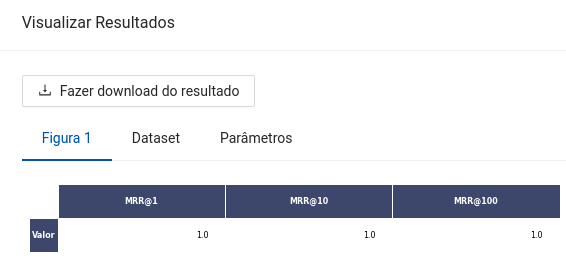

author: Lucas Nunes Sequeira
summary: Retriever
id: retriever
categories: platiagro
environments: Web
status: Published
feedback link: https://github.com/platiagro/tutorials
tags: platiagro-tasks

# Retriever

## Função do componente

O objetivo deste componente é elencar a probabilidade de um conjunto de contextos conter a resposta a uma dada pergunta. Este componente utiliza diferentes modelos de similaridade entre textos para a sua inferência.

* Neste exemplo são feitas duas perguntas distintas para dois contextos distintos.
* A métrica computada é o [MRR](https://en.wikipedia.org/wiki/Mean_reciprocal_rank).
* Observação: Este componente utiliza recursos da internet, portanto é importante estar conectado à rede para que este componente funcione corretamente.

## Entrada esperada

Espera-se como entrada para o componente uma tabela com uma coluna de contextos para a aplicação do Retriever e uma coluna com as perguntas para serem aplicadas aos contextos.

## Parâmetros

A seguir são listados todos os parâmetros utilizados pelo componente:

- **Coluna dos contextos**: `string` (Obrigatório). 
<em>Esta coluna será utilizada para ler os contextos e aplicar o Retriever.</em>

- **Coluna das perguntas**: `string` (Obrigatório). 
<em>Esta coluna será utilizada para identificar as perguntas a serem aplicadas aos contextos.</em>

- **Top N contextos**: `integer` (Obrigatório). 
<em>O número máximo de contextos para elencar por pergunta. Os contextos elencados correspondem aos que obtiveram melhor pontuação do Retriever.</em>

- **Coluna da pontuação das respostas**: `string` (Obrigatório). 
<em>Esta coluna será utilizada para salvar a pontuação dos N contextos selecionados de cada pergunta.</em>

- **Coluna de avaliação**: `string` (Opcional). 
<em>Esta coluna será utilizada para avaliar as respostas produzidas por cada pergunta, deve conter a indicação do contexto esperado para o Retriever. É uma coluna opcional, mas caso preenchido deve ser também preenchida uma coluna de identificação dos contextos.</em>

- **Coluna de identificação dos Contextos**: `string` (Opcional). 
<em>Esta coluna será utilizada para identificar os contextos caso seja informado uma coluna de avaliação.</em>

- **Dispositivo**: `string`, {`"cuda"`, `"cpu"`}, padrão: `"cuda"` (Obrigatório). 
<em>Tipo de dispositivo para efetuar as inferências. Caso selecionado a opção `"cuda"` e ela não estiver disponível na máquina, automaticamente será transferido para `"cpu"`.</em>

- **Modelo do Retriever**: `string`, {`"paraphrase_multilingual"`, `"bm25"`, `"tf_idf"`, `"word2vec"`}, padrão: `"paraphrase_multilingual"` (Obrigatório). 
<em>Modelo para a inferência do Retriever.</em>

## Métricas de performance

As métricas de performance tem o propósito de ajudar o usuário a avaliar a performance do modelo. Essas métricas variam de acordo com o tipo de problema, tal como: classificação, regressão, agrupamento, entre outros.

1. MRR: A métrica MRR (cujo nome provém de Mean Reciprocal Rank) mede a precisão da ordenação dos contextos mais prováveis de conterem a resposta de uma determinada pergunta. Comumente a notação é dada por MRR@`rank`, em que `rank` é o número N de contextos que serão elencados.

## Retorno esperado na experimentação

O retorno durante a experimentação ajuda o usuário a analisar tanto métricas distintas de forma visual, como a distribuição dos dados e os dados brutos ao final da execução. Sendo assim, é possível visualizar diversos retornos para este componente como os listados a seguir:

1. Dataframe com os dados de entrada e a coluna ordenada pela pontuação calculada por cada par contexto e pergunta.

2. Uma tabela com a pontuação obtida para cada texto pela métrica MRR caso seja informado a coluna de avaliação.

## Retorno esperado na implantação

Espera-se como retorno numpy arrays contendo a mesma estrutura dos dados de entrada com duas colunas extras correspondentes às respostas produzidas e suas respectivas pontuações.