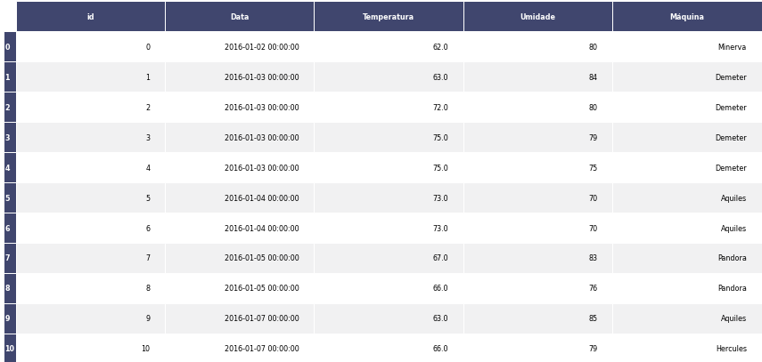

author: Lucas Zanco Ladeira
summary: Eliminação Recursiva de Atributos (RFE)
id: rfe-selector
categories: platiagro
environments: Web
status: Published
feedback link: https://github.com/platiagro/tutorials
tags: platiagro-tasks

# Eliminação Recursiva de Atributos (RFE)

## Função do componente

Esse componente executa a classificação de atributos com eliminação recursiva de atributos com base em um estimador do Random Forest com hiperparâmetros padrão. A validação cruzada, K-fold, é empregada para estimar a importância do recurso. Faz uso da implementação RFECV do [Scikit-learn](https://scikit-learn.org/stable/modules/generated/sklearn.feature_selection.RFECV.html). Scikit-learn é uma biblioteca open source de machine learning que suporta apredizado supervisionado e não supervisionado. Também provê várias ferramentas para montagem de modelo, pré-processamento de dados, seleção e avaliação de modelos, e muitos outros utilitários.

## Entrada esperada

Espera-se como entrada para o componente uma tabela com colunas que representam valores numéricos, categóricos ou de data. A tabela deve ser de um dos seguintes tipos: Comma-separated values (.csv) ou Excel (.xls, .xlsx).

## Parâmetros

A seguir são listados todos os parâmetros utilizados pelo componente:

- **Atributo alvo**: `feature` (Obrigatório). 
<em>Esse valor será utilizado para garantir que o alvo não seja removido.</em>

- **Número mínimo de features**: `integer`, padrão: `3`. 
<em>Número mínimo de features a ser selecionado.</em>

- **Número de folds**: `integer`, padrão: `10`. 
<em>Número de folds para a validação cruzada.</em>

## Retorno esperado na experimentação

O retorno durante a experimentação ajuda o usuário a analisar tanto métricas distintas de forma visual, como a distribuição dos dados e os dados brutos ao final da execução. Sendo assim, é possível visualizar diversos retornos para este componente como os listados a seguir:

1. Tabela dos dados  <em>Apresenta visualização dos dados após o treinamento do modelo com a variável resposta e dados sobre o modelo.</em>

## Retorno esperado na implantação

Dados com as colunas filtradas de acordo com o número mínimo de features e folds no método RFECV.